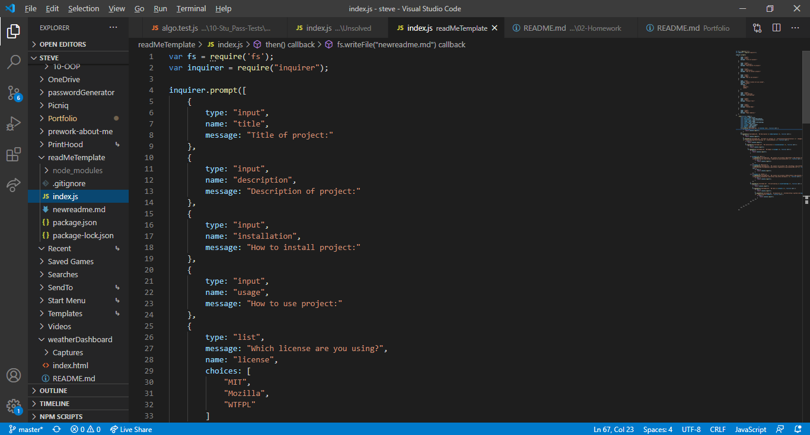
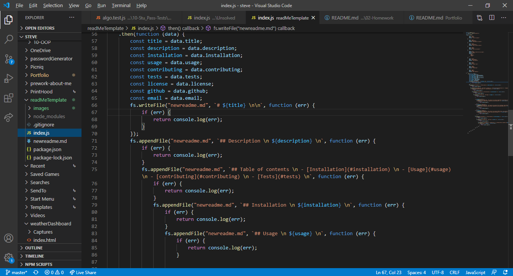
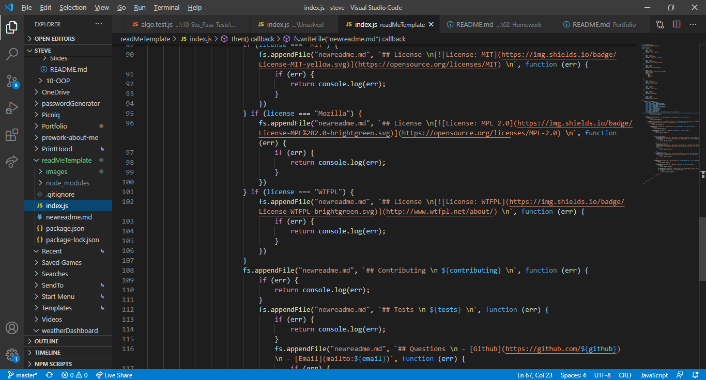
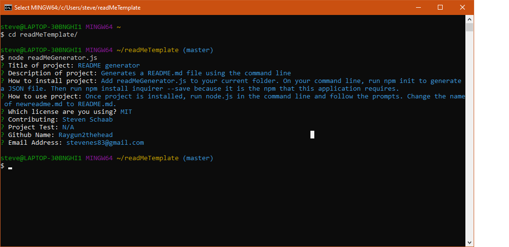
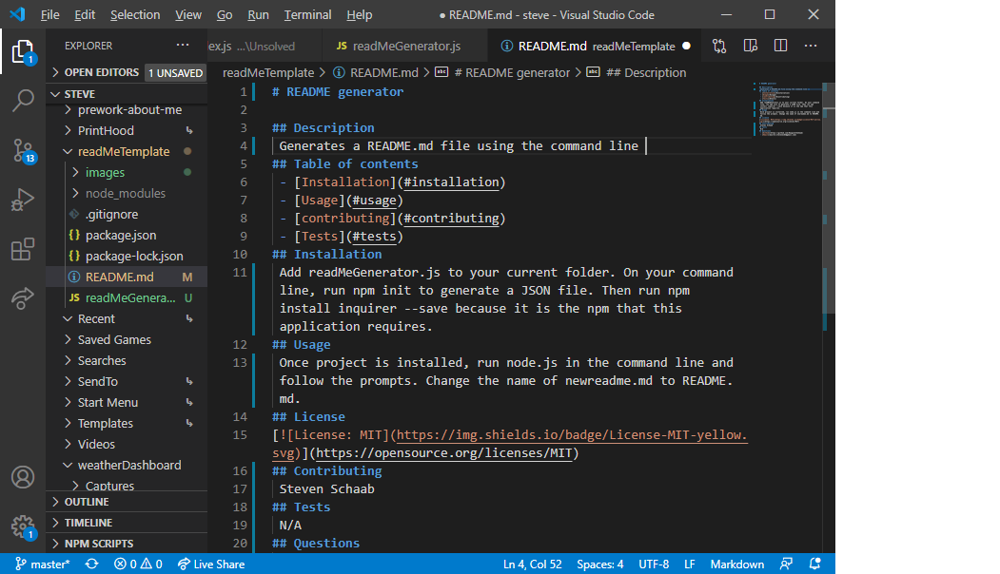

# README generator 

## Description 
 Generates a README.md file using the command line 
 ### Images
 
 
 
 
 
 ### Screencastify
 [Walk through video](https://drive.google.com/file/d/1tB3yAb2E2p1KryixqEd7cZXYS51oQZoV/view?usp=sharing)
## Table of contents 
 - [Installation](#installation) 
 - [Usage](#usage) 
 - [contributing](#contributing) 
 - [Tests](#tests) 
## Installation 
 Add readMeGenerator.js to your current folder. On your command line, run npm init to generate a JSON file. Then run npm install inquirer --save because it is the npm that this application requires. 
## Usage 
 Once project is installed, run node.js in the command line and follow the prompts. Change the name of newreadme.md to README.md. You may have to force remove the old README in the command line.
## License 
 
## Contributing 
 Steven Schaab 
## Tests 
 N/A 
## Questions 
 - [Github](https://github.com/Raygun2thehead) 
 - [Email](mailto:stevenes83@gmail.com)